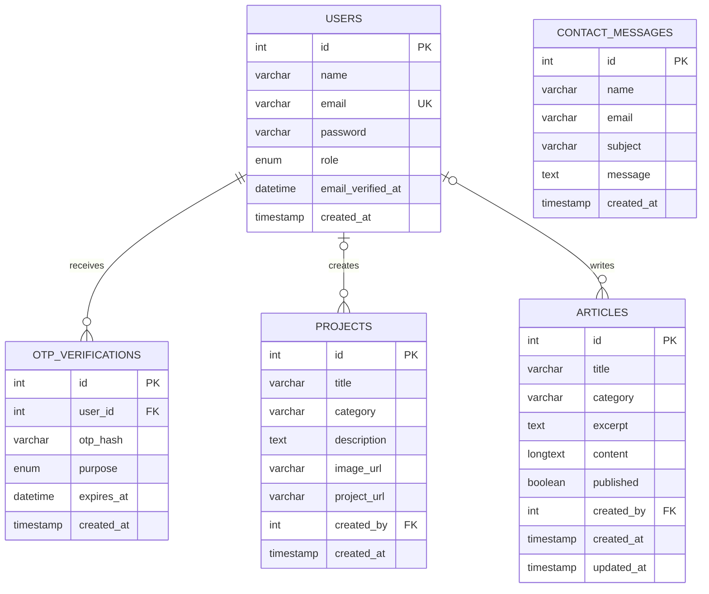

# CreatorSpace — Entity Relationship Diagram

## Database Relationships

## Relationship Explanation

- **Users and OTP verifications:** One user can have multiple OTP verification records. OTP records are deleted when their associated user is deleted.
- **Users and projects:** A user can create multiple projects. If the creator account is deleted, the project remains and its `created_by` value becomes `NULL`.
- **Users and articles:** A user can create multiple articles. If the creator account is deleted, the article remains and its `created_by` value becomes `NULL`.
- **Contact messages:** Messages are stored independently and do not currently have a foreign-key relationship to users.

## Database Design Notes

- Primary keys uniquely identify records.
- The users table uses a unique constraint on email.
- OTP records store a hashed OTP and an expiration timestamp.
- Indexes support project and article category/title queries.
- Passwords and OTPs are stored as hashes rather than plaintext.
