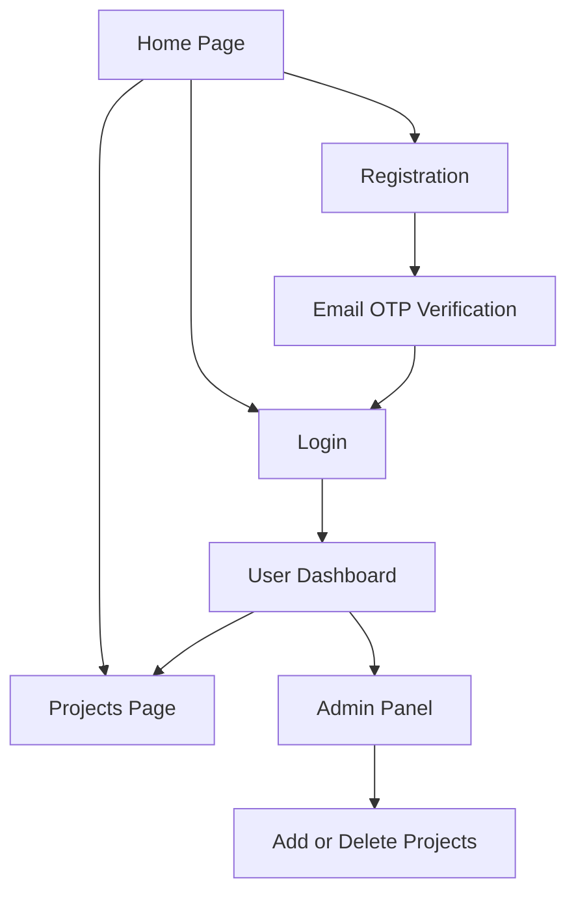

# CreatorSpace — Wireframe Documentation

## 1. Home Page

**Purpose:** Introduce CreatorSpace and showcase featured creative projects.

- **Navbar:** CreatorSpace logo, Home, Projects, Login.
- **Hero section:** Main heading, short description, and call-to-action button.
- **Featured projects:** Project cards showing title, category, and description.
- **Features section:** Highlights the main website capabilities.
- **Footer:** Copyright and website information.

## 2. Login Page

**Purpose:** Allow registered users to access their accounts.

- Email input
- Password input
- Login button
- Registration link
- Error and validation messages

## 3. Registration and OTP Verification

**Purpose:** Register new users and verify their email addresses.

- Name, email, and password fields
- Registration submit button
- Six-digit email verification code field
- OTP verification button
- Verification success or error message

## 4. User Dashboard

**Purpose:** Provide a central area for authenticated users.

- Welcome message
- Total projects, articles, and registered users
- Link to browse projects
- Account information
- Logout button

## 5. Projects Page

**Purpose:** Display and explore portfolio projects.

- Project search input
- Category filter
- Clear filters button
- Project count
- Project cards with title, category, and description

## 6. Admin Panel

**Purpose:** Allow administrators to manage project content and view statistics.

- Summary cards for projects, articles, and users
- Chart.js project-category analytics
- Form to add projects
- List of existing projects
- Delete project controls
- Dashboard navigation and logout

## Navigation Flow

## Design Notes

- Responsive layout for desktop and mobile screens
- Consistent typography, spacing, and purple accent color
- Reusable navigation and project-card styling
- Clear forms, buttons, and feedback messages
